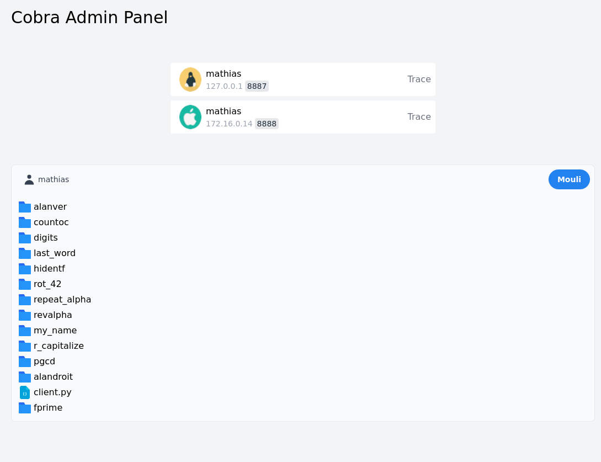

# HTTP Remote

Ce projet vient répondre aux besoins du Coding Club d'EPITECH.

## La problématique

Lors d'un Coding Club, de nombreux participants viennent s'essayer à la programmation. Les "Cobras", formés sur le sujet, encadrent l'événement.

Dans le cadre de certains sujets, il est intéressant pour les encadrants de pouvoir lancer des tests fonctionnels _(moulinettes)_ sur le travail des participants pour en estimer l'avancée.

Deux solutions s'offrent à nous :

- Créer un exécutable obfusqué, simple d'exécution que chaque participant pourrait lancer.
- Transférer le travail vers une de nos machines pour exécuter les tests localement.

La première solution posait différents problèmes :

- L'exécutable doit pouvoir marcher sur n'importe quel OS
- L'excutable nécessite généralement des dépendances et plusieurs fichiers
- Les participants peuvent être amenés à travailler sur leur PC et ne veulent pas forcément installer des tonnes de fichiers et dépendances
- Les encadrants n'ont aucun accès aux résultats de ces tests sans consulter le PC du participant

Nous nous sommes naturellement tournés vers la deuxième solution.

## La solution

HTTP Remote est un programme conçu spécialement pour le Coding Club, il n'est pas un exemple de sécurité pour le monde de l'entreprise par exemple mais pour le cadre de ces ateliers, la sécurité est suffisante.

HTTP Remote tire profit de la permissivité du réseau LAN. Il est composé de trois parties :

- Un serveur principal (un PC d'encadrant)
- Des clients (les PC des participants)
- Un panel d'administration (sur le PC serveur)

Le script client est adapté à Windows, MacOS et Linux. Il n'a que très peu de dépendances et se lance très simplement.

Le script serveur va recevoir les connexions entrantes des scripts clients. Par cette connexion, le serveur va mémoriser les adresses IP locales de chaque ordinateurs clients.

Les scripts clients vont en suite lancer un serveur HTTP sur la machine du participant. Ce serveur pourra recevoir des requêtes du serveur principal et transmettre le contenu des fichiers de travail du participant.

> L'objectif n'est pas d'espionner le PC du participant. Un intervenant ne pourra pas consulter les dossiers parents au working directory du script client.

Le panel, lui, envoie des requêtes authentifiées au serveur principal. Le serveur questionnera à son tour le client ciblé et retournera les informations demandées...



Une fois le Coding Club terminé, le participant pourra simplement supprimer le script client de son ordinateur, celui-ci ne laissera aucune trace de son passage sur la machine.

## Installation

### Serveur

Pour commencer, il convient de séléctionner un poste de travail qui servira de serveur. Ce poste doit être en capacité d'exposer son port 8888 au réseau local et être connecté au même réseau que tous les poste clients.

#### Requirements

Le serveur doit posséder le CLI php8.1 et le nécessaire pour executer les moulinettes (Python3 et ses librairies généralement).

Il est fortement recommandé d'utiliser une distribution Linux sur le poste serveur, de préférence basée sur Debian/Ubuntu.

#### Démarrage

La commande ci-dessous permet de démarrer le serveur:

```bash
./start_server.sh
```

Votre console indiquera:

```
Served on <ip>:8888
```

Il important de retenir l'IP indiquée, il s'agit de l'addresse locale du poste serveur. Il sera nécessaire de la renseigner lors de l'installation client.

### Client

Il faudra transférer le fichier `client.py` (uniquement ce fichier), aux différents postes clients. Ce script est compatible avec tous les systèmes d'exploitations et ne nécessite aucune dépendance Python.

#### Requirements

Le poste client doit posséder Python3.8 ou supérieur.

Le poste doit être en mesure d'exposer son port 8887 (voit la section [Troubleshooting](#troubleshooting) en cas de problème).

#### Démarrage

Pour démarrer le script client, il convient d'ouvrir un terminal dans le dossier de travail du participant et d'executer la commande suivante :

```bash
python3 client.py <ip>
```

L'IP à renseigner étant celle indiquée précedemment par le serveur (sans le port).

## Utilisation

### Serveur

Le PC serveur (et uniquement lui) pourra accéder à une interface graphique en chargeant le fichier `panel/index.html` dans son navigateur (directement en double-cliquant dessus, sans le servir sur un port).

Depuis cette interface, l'administrateur pourra consulter le travail des participants en temps réel, lancer une moulinette et consulter le resultat des tests.

### Client

Les differents PC clients pourront accéder à l'URL `http://<ip>:8888/trace` pour consulter les resultats de leur dernière moulinette (L'IP à renseigner étant celle indiquée précedemment par le serveur)

## Troubleshooting

- Si le client affiche "Connecté" mais ne s'affiche pas sur le panel

Ajouter le port au firewall :

```bash
firewall-cmd --zone=public --add-port=8887/tcp
```

- Si il est impossible d'utiliser le port sur Windows et qu'aucune fenêtre de parefeu ne s'ouvre, executez le CMD en tant qu'Administrateur et réessayez.
